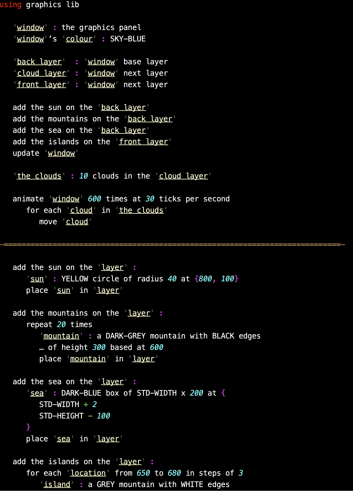

# Remix

## This is the current Remix - implemented in Java
Remix is a flexible programming language based around the idea of mix-fix (as opposed to pre-fix or post-fix) function names, with as many space-separated words and parameters as you want. This means that there is a very straightforward path from designing a program in natural language pseudocode and transitioning it to running Remix code.

To keep function calls as readable as possible, there can be many names for the same function. Multiple names are defined with a simple syntax. e.g.

    pause turtles/turtle for 'time' seconds/second:
is the function signature for a function which can be called with any of the following statements:

    pause turtles for 5 seconds
    pause turtles for 1 second
    pause turtle for 6 seconds
    pause turtle for 1 second

Objects are created using the following syntax, and can have optional automatically generated getter and setter methods for fields (which are otherwise private). Methods which include a "ME" or "MY" parameter, indicating the receiver, are public. Methods without a "ME" or "MY" parameter can only be called from methods in the same object, hence they are private.
You can access object fields using the possessive apostrophe.

    create
        'field1' : value
        'field2' : value

        getter
            'field1'

        setter
            'field2'

        MY method1 :
            body of method

        another method on ME with a 'parameter' :
            body of method
            
        a private method with a 'parameter' but no object parameter :
            body of method

More information about Remix can be found in this [presentation](https://github.com/rsheehan/JRemix/blob/main/RemixIntroduction.pdf).
The first half shows how Remix can be used to develop a program from pseudocode, the second half briefly describes the language.

Here is an animated random landscape program in Remix. N.B. This is how it appears in the Remix editor. In particular note the underlining of variable names.

Remix has a simple library and include file system. Libraries can contain both Java and Remix functions as in the graphics library used in the landscape example.